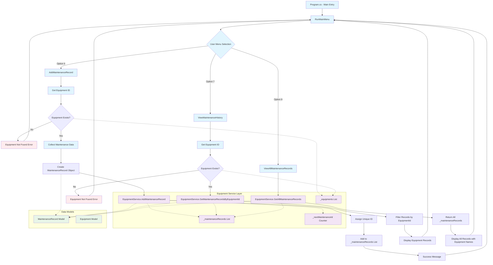
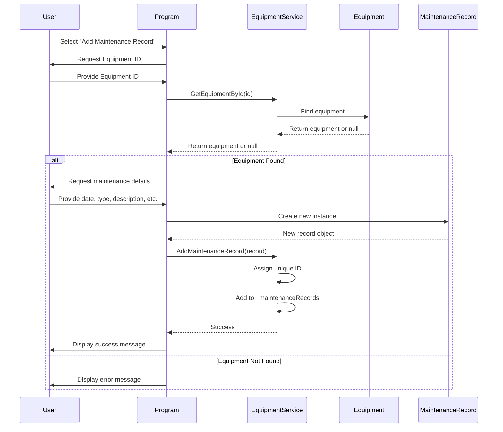
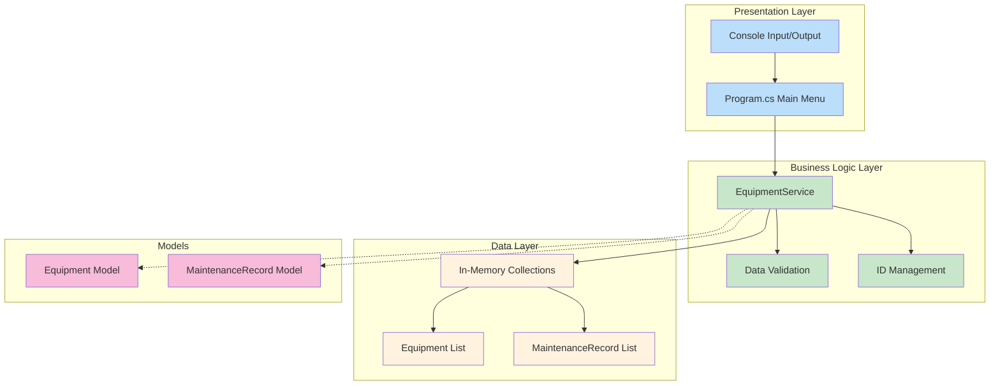

# Equipment Maintenance Record Flow Diagram

## Complete Application Flow



## Data Model Structure

```mermaid
classDiagram
    class Equipment {
        +int Id
        +string Name
        +string SerialNumber
        +string Category
        +DateTime PurchaseDate
        +string Status
    }
    
    class MaintenanceRecord {
        +int Id
        +int EquipmentId
        +DateTime MaintenanceDate
        +string MaintenanceType
        +string Description
        +string PerformedBy
        +decimal Cost
    }
    
    class EquipmentService {
        -List~Equipment~ _equipments
        -List~MaintenanceRecord~ _maintenanceRecords
        -int _nextEquipmentId
        -int _nextMaintenanceId
        +AddEquipment(Equipment equipment)
        +GetEquipmentById(int id) Equipment?
        +UpdateEquipment(Equipment equipment)
        +DeleteEquipment(int id)
        +AddMaintenanceRecord(MaintenanceRecord record)
        +GetMaintenanceRecordsByEquipmentId(int equipmentId) List~MaintenanceRecord~
        +GetAllMaintenanceRecords() List~MaintenanceRecord~
    }
    
    Equipment ||--o{ MaintenanceRecord : "has many"
    EquipmentService --> Equipment : manages
    EquipmentService --> MaintenanceRecord : manages
```

## Sequence Diagram - Adding Maintenance Record



## Component Architecture

